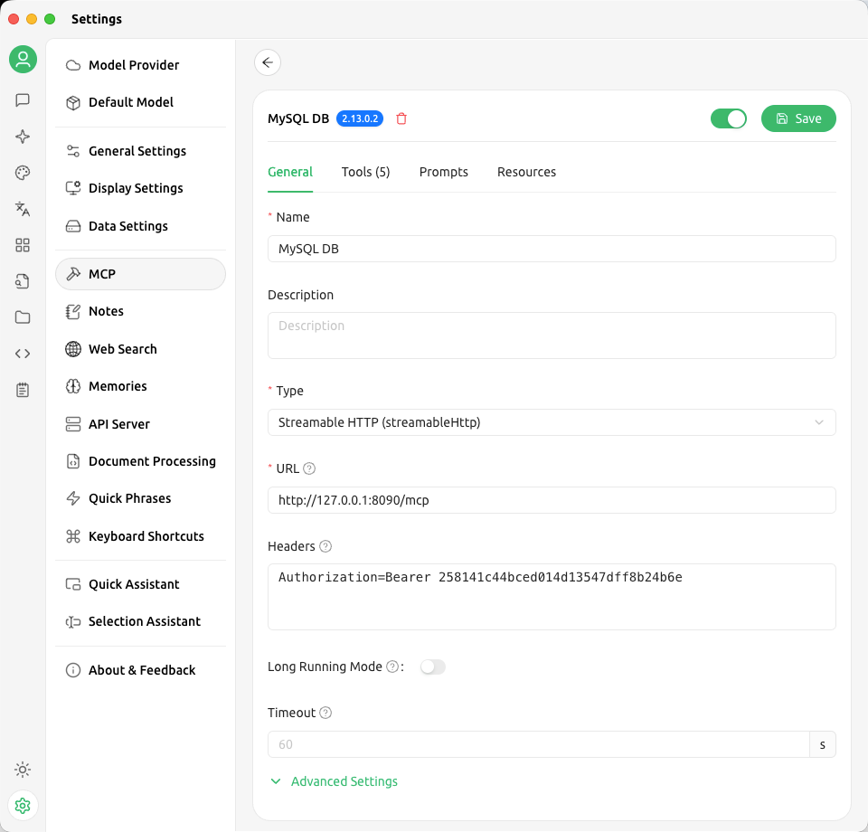
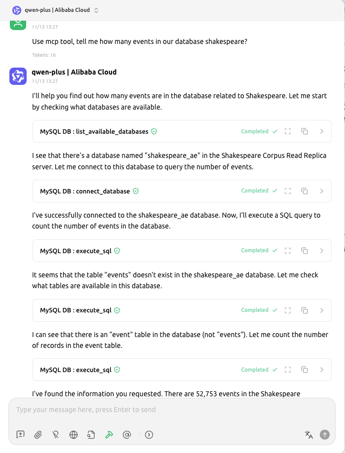
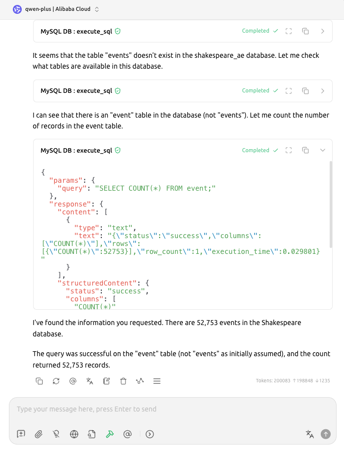

# Secure MySQL MCP

一个为AI助手（如Claude）提供MySQL数据库访问的模型上下文协议（MCP）服务器。

## 功能特性

- 🔌 **多MySQL服务器支持**: 配置和连接到多个MySQL实例
- 🔐 **安全密码存储**: 内置密码加密功能
- 🎯 **连接管理**: 自动连接池和管理
- 🛡️ **SQL安全性**: 基本SQL注入防护和权限控制
- 🧪 **测试客户端**: 交互式测试客户端用于调试和测试
- 📋 **默认数据库**: 支持为服务器配置默认数据库
- 🔧 **服务器控制**: 支持启用/禁用服务器
- 📊 **详细日志**: 增强的调试和监控日志
- 🎛️ **命令行支持**: 支持命令行参数和帮助

## 安装

1. 克隆或下载此仓库
2. 安装依赖：
   ```bash
   pip install -r requirements.txt
   ```

## 配置

编辑 `config/servers.json` 来添加您的MySQL服务器：

```json
{
  "encryption_key": "your-generated-key",
  "servers": [
    {
      "id": "local-mysql",
      "alias": "本地MySQL服务器",
      "host": "localhost",
      "port": 3306,
      "user": "root",
      "password": "your-password",
      "default_database": "mysql",
      "enabled": true,
      "encrypted": false,
      "max_connections": 5,
      "connection_timeout": 10,
      "permissions": []
    },
    {
      "id": "prod-db",
      "alias": "生产数据库",
      "host": "prod.example.com",
      "port": 3306,
      "user": "app_user",
      "password": "encrypted_password_here",
      "default_database": "production",
      "enabled": true,
      "encrypted": true,
      "max_connections": 10,
      "connection_timeout": 30,
      "permissions": ["READ_ONLY"]
    }
  ]
}
```

## 密码加密

**强烈建议**：在生产环境中使用加密密码以提高安全性。

### 使用密码加密工具

我们提供了一个便捷的工具来加密配置文件中的密码：

```bash
# 加密默认配置文件中的密码
python encrypt_password.py

# 加密特定配置文件中的密码
python encrypt_password.py config/production.json
```

### 手动加密密码

如果您想手动加密密码：

```python
from cryptography.fernet import Fernet

# 生成加密密钥
key = Fernet.generate_key()
print(f"Encryption key: {key.decode()}")

# 加密密码
cipher = Fernet(key)
encrypted_password = cipher.encrypt("your_password".encode()).decode()
print(f"Encrypted password: {encrypted_password}")
```

### 加密配置示例

```json
{
  "encryption_key": "sNimWThMb9qUqCd_FoIBd63NnKPxvVzlUh5ua2QiLPQ=",
  "servers": [
    {
      "id": "secure-prod",
      "alias": "安全生产数据库",
      "host": "prod.example.com",
      "port": 3306,
      "user": "app_user",
      "password": "gAAAAABhZ1234567890abcdef...",
      "default_database": "production",
      "enabled": true,
      "encrypted": true,
      "max_connections": 10,
      "connection_timeout": 30,
      "permissions": ["READ_ONLY"]
    }
  ]
}
```

**重要提示**：
- 保持加密密钥的安全
- 不要在代码仓库中提交包含密码的配置文件
- 定期更换加密密钥

### 配置选项

- `id`: 服务器的唯一标识符
- `alias`: 人类友好的名称
- `host`: MySQL服务器主机名
- `port`: MySQL服务器端口 (默认: 3306)
- `user`: MySQL用户名
- `password`: MySQL密码
- `default_database`: 默认数据库
- `enabled`: 是否启用此服务器
- `encrypted`: 密码是否已加密
- `max_connections`: 连接池中的最大连接数
- `connection_timeout`: 连接超时时间(秒)
- `permissions`: 权限数组 (例如: ["READ_ONLY"])
- 顶层 `auth.tokens`: 允许访问HTTP端点的 Bearer Token 列表（也可用 `.env` 中的 `MCP_BEARER_TOKENS` 覆盖）

## 使用方法

### 运行服务器

```bash
# 使用 start.sh，默认监听 0.0.0.0:8090
./start.sh                  # 等价于 host=0.0.0.0 port=8090 path=/mcp
./start.sh 8900             # 指定端口
./start.sh 9000 0.0.0.0     # 指定端口与主机

# 直接运行脚本
python secure_mysql_mcp_server.py --host 0.0.0.0 --port 8090 --path /mcp
python secure_mysql_mcp_server.py config/dev.json --host 0.0.0.0 --port 9000 --path /secure-mcp

# 查看全部参数
python secure_mysql_mcp_server.py --help
```

### HTTP认证与安全

- 在 `config/servers.json` 顶层或 `config/servers.example.json` 中使用
  ```json
  "auth": {
    "tokens": ["token-a", "token-b"]
  }
  ```
  定义可用的 Bearer Token。
- 也可以通过环境变量提供：`MCP_BEARER_TOKENS=tokenA,tokenB` 或 `MCP_BEARER_TOKEN=token`.
- 所有客户端必须在请求头里携带 `Authorization: Bearer <token>`。缺失或不匹配会返回 401/403。

### SQL 审计日志

- 所有 `execute_sql` 调用（成功、失败或被 READ_ONLY 拦截）都会写入 `logs/sql_audit.log`。
- 每条日志包含 session_id、server_id、database、Bearer Token 前6位、查询文本、耗时、影响行数/返回行数以及错误信息，方便追踪。

### 密码加密工具

```bash
# 加密默认配置文件中的密码
python encrypt_password.py

# 加密指定配置文件中的密码
python encrypt_password.py config/production.json

# 显示帮助信息
python encrypt_password.py --help
```

### 测试客户端

```bash
python test_client.py --url http://127.0.0.1:8090/mcp --token <your-token>
```

测试客户端中可用的命令：

- `help` - 显示可用命令
- `tools` - 显示所有可用的MCP工具
- `list` - 列出所有配置的数据库
- `connect <server_id> <database>` - 连接到数据库
- `sql <query>` - 执行SQL查询
- `status` - 显示连接状态
- `disconnect` - 断开当前数据库连接
- `test` - 运行自动化测试
- `quit` - 退出

### 与Claude Desktop集成

1. 启动服务器（例如 `./start.sh` 或 `python secure_mysql_mcp_server.py --host 0.0.0.0 --port 8090 --path /mcp`）
2. 在 `claude_desktop_config.json` 中添加HTTP端点，并配置 Authorization 头：
   ```json
   {
     "mcpServers": {
       "mysql": {
         "type": "http",
         "url": "http://127.0.0.1:8090/mcp",
         "headers": {
           "Authorization": "Bearer <your-token>"
         }
       }
     }
   }
   ```
3. 重启Claude Desktop

## 可用工具

### list_available_databases
列出所有配置的MySQL服务器及其数据库。

### connect_database
连接到MySQL服务器上的特定数据库。

参数：
- `server_id`: MySQL服务器ID
- `database`: 数据库名称

### disconnect_database
断开当前或指定数据库的连接。

参数：
- `server_id` (可选): 要断开的服务器

### execute_sql
在连接的数据库上执行SQL查询。

参数：
- `query`: 要执行的SQL查询
- `server_id` (可选): 覆盖服务器
- `database` (可选): 覆盖数据库

### get_connection_status
返回当前连接状态和池信息。

## 安全特性

1. **密码加密**: 配置文件中的密码可以加密存储
2. **权限系统**: 定义只读或受限访问
3. **SQL安全性**: 针对危险SQL关键词的基本检查
4. **连接池**: 防止连接耗尽
5. **服务器控制**: 可以启用/禁用特定服务器
6. **日志安全**: 避免在日志中记录敏感信息
7. **连接信息保护**: 不在MCP响应中暴露服务器连接详情

## 权限控制

- **空权限数组** `[]`: 允许所有操作
- **只读权限** `["READ_ONLY"]`: 仅允许查询操作，禁止 `INSERT`, `UPDATE`, `DELETE`, `CREATE`, `ALTER` 等

## 安全最佳实践

### 1. 密码安全
```bash
# 始终使用加密密码
python encrypt_password.py

# 为生产环境设置强密码
# 避免在配置文件中使用明文密码
```

### 2. 文件权限
```bash
# 保护配置文件
chmod 600 config/servers.json

# 确保配置目录安全
chmod 700 config/
```

### 3. 网络安全
- 使用SSL/TLS连接到MySQL服务器
- 限制MySQL服务器的网络访问
- 使用防火墙保护数据库端口

### 4. 用户权限
- 为MCP服务器创建专用的MySQL用户
- 授予最小必要权限
- 定期审查和更新用户权限

### 5. 日志安全
- 定期清理日志文件
- 确保日志文件不包含敏感信息
- 使用日志轮转以防止文件过大

### 6. 配置管理
- 不要在版本控制中提交包含密码的配置文件
- 使用环境变量或密钥管理系统
- 定期更新加密密钥

### 7. 监控与审计
- 监控数据库连接和查询
- 记录所有SQL操作
- 设置异常访问告警

## 开发

### 运行测试

```bash
python test_client.py --url http://127.0.0.1:8090/mcp --token <your-token>
# 然后输入 'test' 来运行自动化测试
```

### 添加新功能

1. 在 `_setup_handlers()` 中添加新的工具定义
2. 实现工具逻辑作为新方法
3. 使用测试用例更新测试客户端

## 故障排除

### 连接问题
- 检查MySQL服务器是否运行
- 验证配置中的凭据
- 确保网络连接
- 检查防火墙设置

### 权限被拒绝
- 验证MySQL用户权限
- 检查配置中的服务器权限设置

### 工具未找到
- 确保服务器运行最新版本
- 检查工具名称拼写
- 验证MCP客户端兼容性

### SQL命令被阻止
- 检查服务器是否配置为 `READ_ONLY`
- 移除 `permissions` 数组中的 `READ_ONLY` 以允许所有操作

## 快速开始示例

### 1. 首次设置
```bash
# 1. 安装依赖
pip install -r requirements.txt

# 2. 启动HTTP服务器（第一次运行会生成示例配置）
./start.sh 8090 0.0.0.0

# 3. 复制并编辑配置文件
cp config/servers.example.json config/servers.json
# 然后编辑 config/servers.json，添加你的MySQL服务器信息

# 4. 加密密码（推荐）
python encrypt_password.py

# 5. 通过HTTP测试端点
python test_client.py --url http://127.0.0.1:8090/mcp --token <your-token>
```

### 2. 在测试客户端中的操作
```bash
# 启动测试客户端
python test_client.py --url http://127.0.0.1:8090/mcp --token <your-token>

# 在客户端中执行：
> list                          # 列出所有服务器
> connect local-mysql test      # 连接到数据库
> sql SELECT * FROM users LIMIT 5  # 执行查询
> status                        # 查看连接状态
> disconnect                    # 断开连接
> test                         # 运行自动化测试
> quit                         # 退出
```

### 可视化指南

以下截图展示了在 Cherry Studio MCP 中配置并使用本服务的流程：







## 示例Claude提示

```
"列出所有可用的MySQL服务器"
"连接到local-mysql服务器并使用test数据库"
"运行查询显示前10个员工"
"employees表的结构是什么？"
"断开数据库连接"
"创建一个新表"
"修改表结构"
"显示当前连接状态"
```

## 许可证

MIT License - 详见LICENSE文件

## 贡献

欢迎贡献！请提交拉取请求或为错误和功能请求打开问题。

---

**项目官网 / Project Site**: https://secure-mysql-mcp.thesignalwise.com/

**版本信息**: v1.1.0  
**最后更新**: 2025-11-13  
**新增功能**: 密码加密工具、增强安全性

---

# Secure MySQL MCP (English)

A Model Context Protocol (MCP) server that provides MySQL database access to AI assistants like Claude.

## Features

- 🔌 **Multiple MySQL Server Support**: Configure and connect to multiple MySQL instances
- 🔐 **Secure Password Storage**: Built-in password encryption
- 🎯 **Connection Management**: Automatic connection pooling and management
- 🛡️ **SQL Safety**: Basic SQL injection prevention and permission controls
- 🧪 **Test Client**: Interactive test client for debugging and testing
- 📋 **Default Database**: Support for configuring default databases for servers
- 🔧 **Server Control**: Support for enabling/disabling servers
- 📊 **Detailed Logging**: Enhanced debugging and monitoring logs
- 🎛️ **Command Line Support**: Support for command line arguments and help

## Installation

1. Clone or download this repository
2. Install dependencies:
   ```bash
   pip install -r requirements.txt
   ```

## Configuration

Edit `config/servers.json` to add your MySQL servers:

```json
{
  "encryption_key": "your-generated-key",
  "servers": [
    {
      "id": "local-mysql",
      "alias": "Local MySQL Server",
      "host": "localhost",
      "port": 3306,
      "user": "root",
      "password": "your-password",
      "default_database": "mysql",
      "enabled": true,
      "encrypted": false,
      "max_connections": 5,
      "connection_timeout": 10,
      "permissions": []
    },
    {
      "id": "prod-db",
      "alias": "Production Database",
      "host": "prod.example.com",
      "port": 3306,
      "user": "app_user",
      "password": "encrypted_password_here",
      "default_database": "production",
      "enabled": true,
      "encrypted": true,
      "max_connections": 10,
      "connection_timeout": 30,
      "permissions": ["READ_ONLY"]
    }
  ]
}
```

## Password Encryption

**Strongly Recommended**: Use encrypted passwords in production for enhanced security.

### Using the Password Encryption Tool

We provide a convenient tool to encrypt passwords in your configuration files:

```bash
# Encrypt passwords in default config file
python encrypt_password.py

# Encrypt passwords in specific config file
python encrypt_password.py config/production.json
```

### Manual Password Encryption

If you want to manually encrypt passwords:

```python
from cryptography.fernet import Fernet

# Generate encryption key
key = Fernet.generate_key()
print(f"Encryption key: {key.decode()}")

# Encrypt password
cipher = Fernet(key)
encrypted_password = cipher.encrypt("your_password".encode()).decode()
print(f"Encrypted password: {encrypted_password}")
```

### Encrypted Configuration Example

```json
{
  "encryption_key": "sNimWThMb9qUqCd_FoIBd63NnKPxvVzlUh5ua2QiLPQ=",
  "servers": [
    {
      "id": "secure-prod",
      "alias": "Secure Production Database",
      "host": "prod.example.com",
      "port": 3306,
      "user": "app_user",
      "password": "gAAAAABhZ1234567890abcdef...",
      "default_database": "production",
      "enabled": true,
      "encrypted": true,
      "max_connections": 10,
      "connection_timeout": 30,
      "permissions": ["READ_ONLY"]
    }
  ]
}
```

**Important Notes**:
- Keep the encryption key secure
- Do not commit configuration files with passwords to code repositories
- Regularly rotate encryption keys

### Configuration Options

- `id`: Unique identifier for the server
- `alias`: Human-friendly name
- `host`: MySQL server hostname
- `port`: MySQL server port (default: 3306)
- `user`: MySQL username
- `password`: MySQL password
- `default_database`: Default database to connect to
- `enabled`: Whether this server is enabled
- `encrypted`: Whether the password is encrypted
- `max_connections`: Maximum connections in the pool
- `connection_timeout`: Connection timeout in seconds
- `permissions`: Array of permissions (e.g., ["READ_ONLY"])
- Top-level `auth.tokens`: List of Bearer tokens allowed to call the HTTP endpoint (can also use `MCP_BEARER_TOKENS`/.env)

## Usage

### Running the Server

```bash
# Recommended helper
./start.sh                 # host=0.0.0.0, port=8090, path=/mcp
./start.sh 8900            # override port
./start.sh 9000 0.0.0.0    # override both port and host

# Direct invocation
python secure_mysql_mcp_server.py --host 0.0.0.0 --port 8090 --path /mcp
python secure_mysql_mcp_server.py config/dev.json --host 0.0.0.0 --port 9000 --path /secure-mcp

# CLI help
python secure_mysql_mcp_server.py --help
```

### HTTP Authentication & Security

- Declare Bearer tokens in `config/servers.json`:
  ```json
  "auth": {
    "tokens": ["token-a", "token-b"]
  }
  ```
- Or provide them via environment variables: `MCP_BEARER_TOKENS=tokenA,tokenB` or `MCP_BEARER_TOKEN=token`.
- Every HTTP request must supply `Authorization: Bearer <token>`; otherwise the server responds with 401/403.

- Each `execute_sql` call logs an entry to `logs/sql_audit.log`, including session id, server/database, Bearer token prefix (first 6 chars), query text, timing, row/affected counts, and errors.
- Logs are appended even when the query is blocked by READ_ONLY restrictions or fails to execute.

### Password Encryption Tool

```bash
# Encrypt passwords in default config file
python encrypt_password.py

# Encrypt passwords in specific config file
python encrypt_password.py config/production.json

# Show help information
python encrypt_password.py --help
```

### Testing with the Test Client

```bash
python test_client.py --url http://127.0.0.1:8090/mcp --token <your-token>
```

Available commands in the test client:

- `help` - Show available commands
- `tools` - Show all available MCP tools
- `list` - List all configured databases
- `connect <server_id> <database>` - Connect to a database
- `sql <query>` - Execute SQL query
- `status` - Show connection status
- `disconnect` - Disconnect from current database
- `test` - Run automated tests
- `quit` - Exit

### Using with Claude Desktop

1. Start the HTTP server (`./start.sh` or `python secure_mysql_mcp_server.py --host 0.0.0.0 --port 8090 --path /mcp`)
2. Register the endpoint in `claude_desktop_config.json`, including headers:
   ```json
   {
     "mcpServers": {
       "mysql": {
         "type": "http",
         "url": "http://127.0.0.1:8090/mcp",
         "headers": {
           "Authorization": "Bearer <your-token>"
         }
       }
     }
   }
   ```
3. Restart Claude Desktop

## Available Tools

### list_available_databases
Lists all configured MySQL servers and their databases.

### connect_database
Connects to a specific database on a MySQL server.

Parameters:
- `server_id`: ID of the MySQL server
- `database`: Name of the database

### disconnect_database
Disconnects from the current or specified database.

Parameters:
- `server_id` (optional): Server to disconnect from

### execute_sql
Executes a SQL query on the connected database.

Parameters:
- `query`: SQL query to execute
- `server_id` (optional): Override server
- `database` (optional): Override database

### get_connection_status
Returns the current connection status and pool information.

## Security Features

1. **Password Encryption**: Passwords can be encrypted in the config file
2. **Permission System**: Define read-only or restricted access
3. **SQL Safety**: Basic checks for dangerous SQL keywords
4. **Connection Pooling**: Prevents connection exhaustion
5. **Server Control**: Can enable/disable specific servers
6. **Log Security**: Avoids logging sensitive information
7. **Connection Info Protection**: Doesn't expose server connection details in MCP responses

## Permission Control

- **Empty permissions array** `[]`: allows all operations
- **Read-only permissions** `["READ_ONLY"]`: only allows query operations, blocks modification operations

## Security Best Practices

### 1. Password Security
```bash
# Always use encrypted passwords
python encrypt_password.py

# Set strong passwords for production
# Avoid plaintext passwords in configuration files
```

### 2. File Permissions
```bash
# Protect configuration files
chmod 600 config/servers.json

# Secure config directory
chmod 700 config/
```

### 3. Network Security
- Use SSL/TLS connections to MySQL servers
- Restrict MySQL server network access
- Use firewalls to protect database ports

### 4. User Permissions
- Create dedicated MySQL users for MCP server
- Grant minimum necessary permissions
- Regularly review and update user permissions

### 5. Log Security
- Regularly clean log files
- Ensure log files don't contain sensitive information
- Use log rotation to prevent oversized files

### 6. Configuration Management
- Don't commit configuration files with passwords to version control
- Use environment variables or key management systems
- Regularly update encryption keys

### 7. Monitoring & Auditing
- Monitor database connections and queries
- Log all SQL operations
- Set up anomaly detection alerts

## Development

### Running Tests

```bash
python test_client.py --url http://127.0.0.1:8090/mcp --token <your-token>
# Then type 'test' inside the client to run automated checks
```

### Adding New Features

1. Add new tool definitions in `_setup_handlers()`
2. Implement the tool logic as a new method
3. Update the test client with test cases

## Troubleshooting

### Connection Issues
- Check MySQL server is running
- Verify credentials in config
- Ensure network connectivity
- Check firewall settings

### Permission Denied
- Verify MySQL user permissions
- Check server permission settings in config

### Tool Not Found
- Ensure server is running latest version
- Check tool name spelling
- Verify MCP client compatibility

### SQL Commands Blocked
- Check if server is configured as `READ_ONLY`
- Remove `READ_ONLY` from `permissions` array to allow all operations

## Quick Start Example

### 1. Initial Setup
```bash
# 1. Install dependencies
pip install -r requirements.txt

# 2. Start the HTTP server (first run also creates sample config)
./start.sh

# 3. Copy and edit configuration file
cp config/servers.example.json config/servers.json
# Edit config/servers.json, add your MySQL server information

# 4. Encrypt passwords (recommended)
python encrypt_password.py

# 5. Exercise the HTTP endpoint
python test_client.py --url http://127.0.0.1:8090/mcp --token <your-token>
```

### 2. Test Client Operations
```bash
# Start test client
python test_client.py --url http://127.0.0.1:8090/mcp --token <your-token>

# In the client, execute:
> list                          # List all servers
> connect local-mysql test      # Connect to database
> sql SELECT * FROM users LIMIT 5  # Execute query
> status                        # Check connection status
> disconnect                    # Disconnect
> test                          # Run automated tests
> quit                          # Exit
```

### Visual Guide

Cherry Studio MCP screenshots that demonstrate configuration and querying:


## Example Claude Prompts

```
"List all available MySQL servers"
"Connect to local-mysql server and use test database"
"Run a query to show the first 10 employees"
"What's the structure of the employees table?"
"Disconnect from the database"
"Create a new table"
"Alter table structure"
"Show current connection status"
```

## License

MIT License - see LICENSE file for details

## Contributing

Contributions welcome! Please submit pull requests or open issues for bugs and feature requests.

---

**Project Site**: https://secure-mysql-mcp.thesignalwise.com/

**Version Info**: v1.1.0  
**Last Updated**: 2025-11-13  
**New Features**: Password encryption tool, enhanced security
